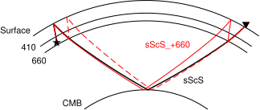

@def title = "GMTとTauPでレイパスを描く方法"

以下は https://docs.gmt-china.org/6.2/examples/ex002/ を参考にしました。

Obspy.TauPでレイパスを描こうとすると全球かCartesianかしか私はできなかったので、もうちょっと綺麗に描きたくなりました。
GMTとTauPで以下のようにするとできました。

```bash
#!/bin/bash

gmt begin sScS pdf
gmt set MAP_GRID_PEN_PRIMARY 1p

# ground. +a: azimuth from North; +t: offset of origin
gmt basemap -JP10c+a+t30 -R-5/65/0/6371 -Byg6371 -BS
# 440 discon
gmt basemap -Byg6371+5961 -BS
# 660 discon
gmt basemap -Byg6371+5711 -BS
# CMB
gmt basemap -Byg6371+3481 -BS

taup_path -mod prem -ph sScS -h 590 -deg 60 -o sScS.raypath
taup_path -mod prem -ph sScSSv660s -h 590 -deg 60 -o sScSSv660s.raypath
taup_path -mod prem -ph sSv660sScS -h 590 -deg 60 -o sSv660sScS.raypath

# raypath
gmt plot sScS.raypath.gmt -W1.5p,black
gmt plot sScSSv660s.raypath.gmt -W1p,red
gmt plot sSv660sScS.raypath.gmt -W1p,red,-

gmt plot -S -Gblack -N << EOF
0 5781 0.4c a
60 6471 0.4c i
EOF

gmt text -F+f11p+a -N << EOF
-8 6871 0 Surface
-8 6171 0 410
-8 5621 0 660
-8 3881 0 CMB
52 4100 0 @;black;sScS@;;
38 5000 0 @;red;sScS_+660@;;
EOF
gmt end
rm sScS.raypath.gmt sScSSv660s.raypath.gmt sSv660sScS.raypath.gmt
```



## TauPのインストール

## GMTのインストール
